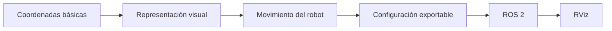

<div align="center">


<br/>


<br/><br/>

<a href="https://tfg-enjambre-drones.github.io/inicio-vuelo-drones/">
  
</a>
<a href="https://tfg-enjambre-drones.github.io/ejemplo-robot-colaborativo/">
  
</a>

</div>

---

# 🚁 TFG - Visualización Didáctica de Robots con ROS 2 y RViz

Este repositorio presenta el desarrollo de un Trabajo Fin de Grado orientado a facilitar la comprensión de conceptos de robótica, representación espacial y visualización mediante herramientas accesibles para alumnado con conocimientos iniciales.

El proyecto combina **webapps didácticas**, configuración de modelos robóticos, representación tridimensional y preparación de datos para su uso en entornos basados en **ROS 2** y **RViz**.

> Este README presenta la visión general del proyecto.  
> Las webapps incluidas tienen sus propios recursos, interfaces y configuraciones específicas.

---

## ✨ Vista general

<div align="center">

<table>
<tr>
<td align="center" width="33%">
<h3>🚁 Enjambre de drones</h3>
<p>Visualización de formaciones con hasta <strong>6 drones</strong>, LEDs y coordenadas X/Y/Z.</p>
</td>
<td align="center" width="33%">
<h3>🤖 Robot colaborativo</h3>
<p>Representación de un <strong>robot sobre raíl</strong> con rótulas, pinza y movimiento lateral.</p>
</td>
<td align="center" width="33%">
<h3>🧭 ROS 2 y RViz</h3>
<p>Organización de datos y modelos para su representación robótica y visualización 3D.</p>
</td>
</tr>
<tr>
<td align="center">
<h3>📍 Coordenadas</h3>
<p>Uso didáctico de posiciones espaciales para comprender movimiento y colocación.</p>
</td>
<td align="center">
<h3>📤 Exportación</h3>
<p>Generación de configuraciones en <strong>Python</strong> y <strong>JSON</strong>.</p>
</td>
<td align="center">
<h3>🌐 GitHub Pages</h3>
<p>Publicación de las webapps como recursos interactivos accesibles desde navegador.</p>
</td>
</tr>
</table>

</div>

---

## 🔗 WebApps publicadas

| WebApp | Descripción | Enlace |
|---|---|---|
| 🚁 **Visualizador de formaciones de drones** | Permite activar drones, modificar coordenadas X/Y/Z, cambiar colores LED, cargar modelo STL y exportar configuraciones. | [Abrir WebApp](https://tfg-enjambre-drones.github.io/inicio-vuelo-drones/) |
| 🤖 **Robot colaborativo sobre raíl** | Muestra un robot de un solo brazo con rótulas, ejes locales, pinza abierta/cerrada y movimiento lateral sobre raíl. | [Abrir WebApp](https://tfg-enjambre-drones.github.io/ejemplo-robot-colaborativo/) |

---

## 🎯 Objetivo del proyecto

El objetivo principal es construir un conjunto de recursos visuales y técnicos que permitan explicar conceptos de robótica de forma progresiva y comprensible.

El proyecto se centra en:

- representar robots de forma visual e interactiva;
- comprender coordenadas espaciales;
- trabajar con configuraciones exportables;
- relacionar webapps educativas con estructuras reutilizables en ROS 2;
- preparar modelos y posiciones para su visualización en RViz;
- facilitar la explicación a alumnado con conocimientos iniciales de informática y robótica.

---

## 🧩 Componentes desarrollados

| Componente | Descripción | Estado |
|---|---|---|
| 🚁 **WebApp de drones** | Visualizador didáctico de formaciones de drones con LEDs y coordenadas X/Y/Z. | ✅ Funcional |
| 🤖 **WebApp de robot colaborativo** | Simulación visual de un robot sobre raíl con rótulas, pinza y ejes locales. | ✅ Funcional |
| 🧭 **Configuraciones exportables** | Generación de datos en Python y JSON para reutilización técnica. | ✅ Funcional |
| 🧱 **Modelos 3D** | Uso de modelos STL y representación visual de elementos robóticos. | ✅ Funcional |
| 🟦 **ROS 2** | Organización conceptual del proyecto para nodos, poses y control de entidades robóticas. | 🟡 Integración didáctica |
| 🟪 **RViz** | Visualización de modelos, posiciones y marcadores asociados a los robots. | 🟡 Visualización didáctica |

---

## 🚁 WebApp de formaciones de drones

La WebApp de drones permite representar un pequeño enjambre dentro de una escena visual e interactiva.

Características principales:

- activación de **1, 3 o 6 drones**;
- selección de formaciones geométricas;
- modificación de coordenadas **X**, **Y** y **Z**;
- control individual del color LED;
- carga opcional de modelo `.stl`;
- vuelta al modelo estándar;
- animación de transición entre formaciones;
- exportación en Python y JSON.

<div align="center">

<a href="https://tfg-enjambre-drones.github.io/inicio-vuelo-drones/">
  
</a>

</div>

---

## 🤖 WebApp de robot colaborativo sobre raíl

La WebApp del robot colaborativo representa un único robot desplazándose sobre un raíl con movimiento lateral.

Características principales:

- movimiento izquierda-derecha sobre raíl;
- brazo con rótulas articuladas;
- tramos de longitud fija;
- ejes locales en cada rótula;
- interacción mediante selección y arrastre de articulaciones;
- pinza abierta o cerrada;
- exportación de configuración en Python y JSON.

<div align="center">

<a href="https://tfg-enjambre-drones.github.io/ejemplo-robot-colaborativo/">
  
</a>

</div>

---

## 🧠 Enfoque didáctico

El proyecto se ha diseñado con una progresión visual sencilla:



La finalidad es que el alumnado pueda observar primero el comportamiento visual de los robots y después relacionarlo con conceptos propios de sistemas robóticos.

---

## 📍 Sistema de coordenadas

Las webapps utilizan coordenadas espaciales para representar la posición de los elementos.

| Coordenada | Interpretación general |
|---|---|
| **X** | Desplazamiento lateral. |
| **Y** | Profundidad o avance en el plano. |
| **Z** | Altura respecto al suelo. |

En la WebApp del robot colaborativo, el raíl limita el movimiento principal al desplazamiento lateral.  
En la WebApp de drones, las tres coordenadas permiten representar formaciones espaciales.

---

## 🧭 ROS 2 y RViz

<div align="center">


</div>

El proyecto se relaciona con ROS 2 mediante la organización de robots, posiciones, colores, modelos y configuraciones exportadas.

RViz se emplea como referencia para la visualización de:

- modelos robóticos;
- posiciones espaciales;
- marcadores visuales;
- estructuras del robot;
- relaciones entre entidades.

---

## 📤 Exportación de configuraciones

Las webapps generan datos exportables en dos formatos:

| Formato | Uso |
|---|---|
| **Python** | Define estructuras reutilizables para representar drones, robot, posiciones, colores y estados. |
| **JSON** | Permite guardar configuraciones de forma estructurada y portable. |

Ejemplo general:

```python
ROBOT_CONFIG = {
    "position": {
        "x": 0.0,
        "y": 0.0,
        "z": 1.2
    },
    "state": "active"
}
```

---

## 📁 Estructura general del repositorio

```text
TFG-Enjambre-Drones/
├── README.md
├── webapp-drones/
│   ├── index.html
│   ├── dron_base.stl
│   └── assets/
├── webapp-robot-colaborativo/
│   ├── index.html
│   └── assets/
├── ros2/
│   └── paquetes_de_trabajo/
└── docs/
    └── documentacion/
```

> La estructura puede variar según la rama o la organización concreta del repositorio, pero el README principal actúa como punto de entrada al proyecto.

---

## 🖼️ Capturas del proyecto

1.- Vista del visualizador de drones.

<div align="center">


</div>

<br/>

2.- Vista del robot colaborativo sobre raíl.

<div align="center">


</div>

> Las capturas se almacenan en la carpeta `assets/` del repositorio principal.

---

## 🚀 Ejecución local de las WebApps

Las webapps pueden ejecutarse de forma local abriendo su archivo `index.html` en un navegador moderno.

Pasos generales:

1. Descargar o clonar el repositorio.
2. Abrir la carpeta de la webapp correspondiente.
3. Ejecutar `index.html` desde el navegador.
4. Interactuar con los controles de la aplicación.
5. Exportar la configuración si es necesario.

---

## 🌐 Publicación con GitHub Pages

Las webapps se han publicado como páginas estáticas en GitHub Pages.

| WebApp | URL |
|---|---|
| 🚁 Visualizador de drones | https://tfg-enjambre-drones.github.io/inicio-vuelo-drones/ |
| 🤖 Robot colaborativo | https://tfg-enjambre-drones.github.io/ejemplo-robot-colaborativo/ |

---

## 🧪 Estado actual

<div align="center">

<table>
<tr>
<td align="center"><strong>WebApp Drones</strong><br/>✅ Publicada</td>
<td align="center"><strong>WebApp Robot</strong><br/>✅ Publicada</td>
<td align="center"><strong>Exportación Python</strong><br/>✅ Disponible</td>
</tr>
<tr>
<td align="center"><strong>Exportación JSON</strong><br/>✅ Disponible</td>
<td align="center"><strong>ROS 2</strong><br/>🟡 Integración didáctica</td>
<td align="center"><strong>RViz</strong><br/>🟡 Visualización didáctica</td>
</tr>
</table>

</div>

---

## 🔒 Nota sobre privacidad

Este repositorio forma parte de un Trabajo Fin de Grado en desarrollo académico.  
Los recursos publicados corresponden a webapps didácticas y elementos de visualización.

---

## 📌 Licencia

Uso académico y educativo.

---

<div align="center">


</div>
